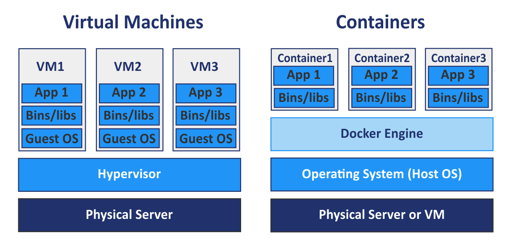

# All I know about Docker

## Instalation for windows
1. [WSL 2](https://docs.microsoft.com/en-us/windows/wsl/wsl2-kernel)
2. [Docker](https://www.docker.com/get-started)

## VMs vs Containers

[Image Source](https://www.nakivo.com/blog/docker-vs-kubernetes/)

## Docker commands
`docker ps` : List of running containers

## Docker file
## Images
## Containers

## Magento on docker
Betnami magento image: https://hub.docker.com/r/bitnami/magento/

01.install WSL https://docs.microsoft.com/en-us/windows/wsl/wsl2-kernel

02.install docker

03.restart computer

04.go to cmd 
	then type:	wsl
	then type:	sysctl -w vm.max_map_count=262144

05.go to a folder of choise and open a terminal
	then type: curl -sSL https://raw.githubusercontent.com/bitnami/bitnami-docker-magento/master/docker-compose.yml > docker-compose.yml
	then type: docker-compose up -d

06.wait until the setup finishes

07.now you have a bitnami/magento App running but with no data

08.add PHP_MEMORY_LIMIT=2048M inside environment section that's inside the magento section that's indside docker-compose.yml file

09.type: sudo /opt/bitnami/magento/htdocs/bin/magento sampledata:deploy
	inside cli of magento

10.type: sudo /opt/bitnami/magento/htdocs/bin/magento setup:upgrade

OPTIONAL.inside the web server, install vim
	type: sudo apt-get update
	type: sudo apt-get install vim

## **Junk notes**

docker network create magento-tier
docker volume create --name mariadb_data

docker run -d --name mariadb \
 -e ALLOW_EMPTY_PASSWORD=yes \
 -e MARIADB_USER=bn_magento \
 -e MARIADB_PASSWORD=your_password \
 -e MARIADB_DATABASE=bitnami_magento \
 --net magento-tier \
 --volume mariadb_data:/bitnami \
 bitnami/mariadb:latest
 
docker volume create --name magento_data
docker run -d --name magento -p 80:80 -p 443:443 \
 -e MAGENTO_DATABASE_USER=bn_magento \
 -e MAGENTO_DATABASE_PASSWORD=your_password \
 -e MAGENTO_DATABASE_NAME=bitnami_magento \
 --net magento-tier \
 --volume magento_data:/bitnami \
 bitnami/magento:latest
 
 C:\Users\Abderrahim>wsl
JW3:/mnt/host/c/Users/Abderrahim# sysctl -w vm.max_map_count=262144
vm.max_map_count = 262144
JW3:/mnt/host/c/Users/Abderrahim# php
-sh: php: not found
JW3:/mnt/host/c/Users/Abderrahim#

php -r "ini_set('memory_limit', '2048M');"

COMPOSER_MEMORY_LIMIT=2048 composer update
php -d memory_limit=2048M composer update

COMPOSER_MEMORY_LIMIT=2048M php composer.phar update

/opt/bitnami/php/bin/composer
php -d memory_limit=-1 phar.phar

php -c php.ini -d memory_limit=-1

bitnami/magento/htdocs/composer.json

find . -name "console"

php -d memory_limit=2048M composer update

php -r "phpinfo();"
php -r "echo ini_get('memory_limit').PHP_EOL;"

php -d memory_limit=-1 /opt/bitnami/php/bin/composer update

install vim

echo 'memory_limit = -1' >> /usr/local/etc/php
sudo /opt/bitnami/magento/htdocs/bin/magento sampledata:deploy
